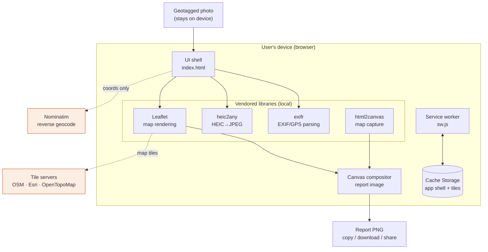
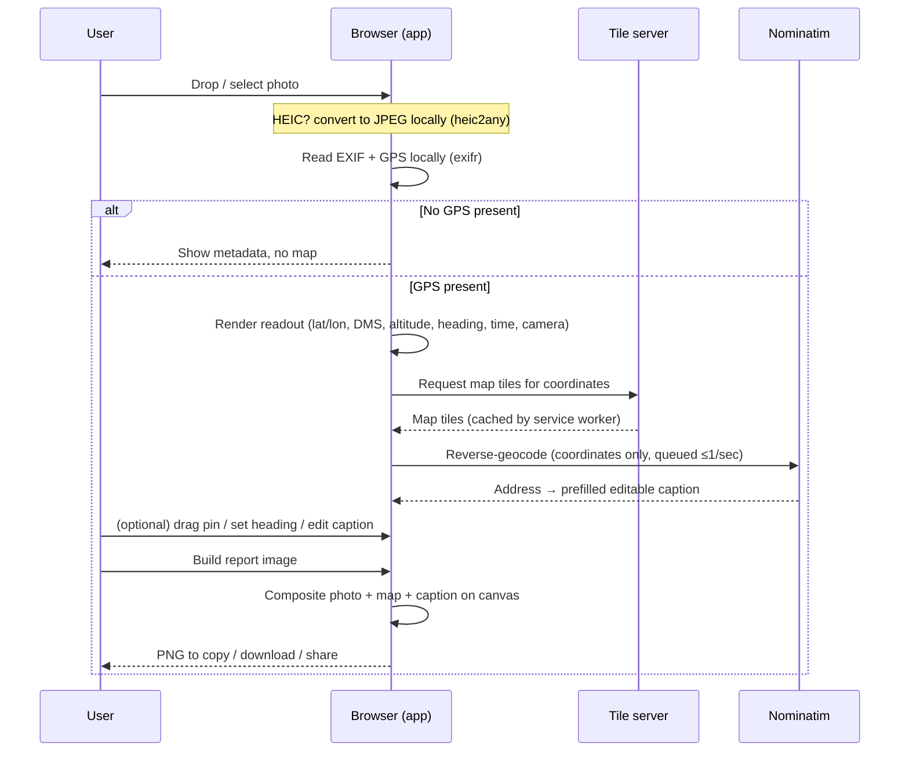

# GeoTag · Field Inspection Mapper

## Design & Architecture Document

| | |
|---|---|
| **Document status** | For review — IT & Digital Services |
| **Application** | GeoTag · Field Inspection Mapper |
| **Type** | Progressive Web App (PWA), client-side only |
| **Repository** | `nerjo/geotag` |
| **Version / build** | Service-worker cache `geotag-v2` |
| **Last updated** | 16 June 2026 |
| **Author** | Application owner, with Claude Code (AI pair-programmer) |

---

## 1. Executive summary

GeoTag is a lightweight, installable web application that lets field staff turn a
geotagged photograph into a documented, map-referenced **inspection report image**
— without uploading the photograph anywhere.

A user drops one or more photos onto the page. For each photo the app reads the
embedded GPS metadata **in the browser**, plots the location on an interactive
map, looks up a human-readable address, and produces a side-by-side
**photo + map** image with a coordinate caption that can be copied, downloaded, or
shared straight into an inspection report.

The defining architectural characteristic is **privacy by design**: photographs
and their coordinates are processed entirely on the user's device. The only
network traffic is for map tiles and an optional address lookup — never the
photo itself. The app is a single static HTML file with vendored libraries, so it
has **no backend, no database, no user accounts, and no server-side data
storage**. It runs fully offline once installed.

This document describes the design, the technology choices, the data-flow and
privacy posture relevant to an IT/security review, the deployment model, and — at
the request of the business — **how the application was built collaboratively**
with an AI pair-programmer.

---

## 2. Purpose & problem statement

Field inspectors routinely take geotagged photos and then need to evidence
*where* each photo was taken inside a written report. The manual process is slow
and error-prone: copy coordinates out of a phone, paste them into a separate
mapping tool, screenshot the map, crop it, and paste photo and map side by side.

GeoTag collapses that workflow into a single drag-and-drop step, while keeping the
source imagery on the device. It is aimed at:

- **Field inspectors / surveyors** producing site documentation.
- **Back-office staff** assembling inspection or compliance reports.
- Any workflow that needs *"photo + verified location"* as a single artefact.

### Design goals

1. **Privacy first** — image data must never leave the device.
2. **Zero install friction** — works from a URL; installable without an app store.
3. **Works in the field** — fully functional offline after first load.
4. **Report-ready output** — a clean, branded, copy/paste-able image.
5. **No operational backend** — nothing to host, patch, or breach server-side.

---

## 3. Key features

| Feature | Description |
|---|---|
| **On-device EXIF/GPS read** | Latitude/longitude (decimal & DMS), altitude, heading, capture time, and camera make/model parsed from the photo in the browser. |
| **Multi-photo workspace** | Any number of photos can be added; each gets its own card, map, and report button. |
| **Interactive map** | Leaflet map with **Street** (OpenStreetMap), **Satellite** (Esri World Imagery), and **Topo** (OpenTopoMap) styles. |
| **Reverse geocoding** | Optional human-readable address from OpenStreetMap Nominatim, auto-filled into an editable caption. |
| **Draggable pin** | The location pin can be nudged to correct GPS drift; the report is flagged as *"manually adjusted"* when this happens. |
| **Heading / direction cone** | Camera-pointing direction shown as a cone on the map; pre-filled from EXIF or set by hand. |
| **HEIC support** | iPhone `.heic` photos are converted to a viewable JPEG in-browser. |
| **Report image export** | Composited photo + map PNG with coordinate caption and product footer, rendered on a `<canvas>`. |
| **Copy / Download / Share** | Output can be copied to clipboard, downloaded as PNG, or shared via the native OS share sheet. |
| **Installable PWA** | Adds to home screen / desktop; launches in its own window. |
| **Offline-capable** | App shell, libraries, and fonts are precached; previously viewed map tiles are cached too. |

---

## 4. Architecture overview

GeoTag is a **single-page, client-side static application**. There is no
application server — the "backend" is simply a static file host plus a small
number of third-party tile/geocoding services called directly from the browser.



### 4.1 Logical layers

1. **Presentation / shell** — `index.html` contains the markup, an inline CSS
   design system, and the application logic in a single IIFE. The visual identity
   is a "field instrument / surveyor" aesthetic (IBM Plex type, hi-vis orange,
   blueprint grid).
2. **Processing libraries** — four vendored, self-contained JavaScript libraries
   (see §5) handle EXIF parsing, HEIC decoding, map rendering, and DOM-to-canvas
   capture.
3. **Compositor** — a `<canvas>` routine draws the photo, a clean off-screen copy
   of the map, the pin/heading cone, and the caption block into the final report
   image.
4. **Offline layer** — `sw.js`, a service worker, precaches the app shell and
   runtime-caches map tiles.

### 4.2 Per-photo component model

Each uploaded photo is handled by an isolated `createPhoto()` instance that owns
its own card DOM, Leaflet map, marker, and state object
(`{lat, lon, heading, caption, pinMoved, …}`). Instances are tracked in a single
`photos[]` array. Global controls — map-style switch, *Clear all*, window resize —
fan out to every instance. This keeps multi-photo behaviour predictable without a
framework or shared mutable global state.

---

## 5. Technology stack

GeoTag deliberately uses **no build step and no framework**. It is plain
HTML/CSS/JavaScript, served as static files. All third-party code is **vendored**
(committed into `vendor/`) rather than loaded from a CDN, which guarantees offline
operation and removes runtime dependency on external script hosts.

| Component | Version | Purpose | Licence |
|---|---|---|---|
| **Leaflet** | 1.9.4 | Interactive map rendering | BSD-2-Clause |
| **exifr** | (vendored UMD) | EXIF / GPS metadata parsing | MIT |
| **html2canvas** | 1.4.1 | Capture the live map into the export canvas | MIT |
| **heic2any** | (vendored) | Convert HEIC photos to JPEG in-browser | MIT |
| **IBM Plex** fonts | — | Sans / Sans Condensed / Mono (self-hosted woff2) | SIL OFL 1.1 |

> **Note for IT:** all of the above are permissively licensed (MIT / BSD / OFL)
> and are pinned and vendored. There is no `npm install`, no transitive dependency
> tree resolved at build time, and no package registry in the runtime path.

### Why no framework / no build

- The whole app is small enough that a framework would add more weight than it
  saves.
- A single static file is trivially auditable, trivially hosted, and has the
  smallest possible attack surface.
- No build pipeline means no build-time supply-chain step to secure.

---

## 6. Data flow & processing

### 6.1 Lifecycle of a single photo



### 6.2 What is processed where

| Data | Where it is processed | Leaves the device? |
|---|---|---|
| Photograph (pixels) | In-browser only | **No** |
| EXIF / GPS metadata | In-browser only | **No** (except coordinates, see below) |
| Coordinates (lat/lon) | In-browser | **Only** sent to the chosen tile server and to Nominatim, to fetch a map and an address |
| Address (reverse geocode result) | In-browser | No (received from Nominatim) |
| Final report image | Generated in-browser | No — stays local until the user explicitly downloads/copies/shares it |

The privacy banner in the UI states this plainly to the end user:
*"Photos are read in your browser. Nothing is uploaded — coordinates never leave
this device (map tiles & optional address lookup excepted)."*

---

## 7. Privacy, security & compliance posture

This section is intended to support an IT / security / data-protection review.

### 7.1 Data handling

- **No upload of images.** Photo bytes are read locally via the File API and
  object URLs; they are never transmitted.
- **No server, no database, no accounts.** There is nothing to store, and nothing
  to be breached server-side. There is no telemetry or analytics.
- **No cookies, no tracking, no local persistence of user content.** The app keeps
  state in memory for the session only. The only browser storage used is the
  service-worker **Cache Storage** (static assets + map tiles), which contains no
  personal data beyond the map imagery of areas the user has viewed.

### 7.2 Network egress (the complete list)

The app makes outbound requests to only the following hosts, and only for the
purposes stated:

| Host | Purpose | Data sent |
|---|---|---|
| `tile.openstreetmap.org` | Street map tiles | Tile coordinates (derived from location) |
| `server.arcgisonline.com` | Esri satellite tiles | Tile coordinates |
| `tile.opentopomap.org` | Topographic tiles | Tile coordinates |
| `nominatim.openstreetmap.org` | Reverse geocode (address) | Latitude/longitude only |

There are **no other endpoints**. No first-party backend exists. If these hosts
are blocked, the app still reads photos and shows coordinates; only the map
imagery and address lookup degrade gracefully.

> **Consideration for IT:** these are public community/third-party services with
> their own usage policies (e.g. the OSM tile and Nominatim usage policies). For
> high-volume or guaranteed-availability use, the tile and geocoding endpoints can
> be repointed to an organisation-hosted or commercial provider — this is a small,
> localised change (see §11).

### 7.3 Client-side security characteristics

- **Output integrity / safe rendering.** All user- and EXIF-derived strings are
  HTML-escaped before insertion into the DOM (`esc()` helper), mitigating XSS from
  malicious file metadata.
- **CORS-clean canvas.** Map tiles are requested with CORS and cached as-is so the
  export canvas is never "tainted", keeping the copy/download/share path working
  without exposing cross-origin pixels insecurely.
- **No `eval`, no dynamic remote script.** All executable code is the vendored,
  reviewable libraries plus the inline application logic. Nothing is fetched and
  executed at runtime.
- **Graceful failure.** Missing libraries, missing GPS, failed conversions, and
  offline geocoding all produce a clear message rather than a broken state.

### 7.4 Recommended deployment hardening

- Serve over **HTTPS** (required for service workers and clipboard/share APIs).
- Apply a **Content-Security-Policy** restricting `script-src` to `self` and
  `connect-src`/`img-src` to the four hosts above (and `data:` for inline pin
  imagery). Because all scripts are same-origin, a strict CSP is straightforward.
- Standard static-hosting headers (HSTS, `X-Content-Type-Options: nosniff`,
  `Referrer-Policy`).

---

## 8. Offline & Progressive Web App design

GeoTag is a fully installable PWA defined by `manifest.webmanifest` (name, icons,
theme colour, standalone display) and powered by the `sw.js` service worker.

**Caching strategy:**

- **App shell — cache-first.** On install, the service worker precaches everything
  needed to open the app with no network: `index.html`, all vendored libraries,
  fonts, and icons (listed in `SHELL_ASSETS`). Navigations fall back to the cached
  `index.html` when offline.
- **Map tiles — stale-while-revalidate, capped.** Tiles are served from cache
  immediately when available and refreshed in the background, into a separate
  cache capped at **300 tiles** (oldest trimmed first) so storage stays bounded.
- **Everything else (e.g. Nominatim) — pass-through.** Cross-origin, non-tile
  requests are not cached; the app already degrades gracefully when they fail.

**Versioning / updates:** the cache name carries a version
(`CACHE_VERSION = "geotag-v2"`). Bumping it on any asset change causes the service
worker to install a fresh shell cache and delete stale caches on activation, so
clients pick up new builds cleanly.

---

## 9. Deployment & operations

### 9.1 Hosting model

GeoTag is a set of **static files** served from the repository root. It can be
hosted on essentially any static host:

- GitHub Pages, Netlify, Cloudflare Pages, Azure Static Web Apps, S3 + CloudFront,
  or an internal static web server / intranet file share served over HTTPS.

There is **no runtime, no server process, no database, and no scheduled job** to
operate. Operationally the application is "deploy the files and serve them over
HTTPS."

### 9.2 Project layout

```
index.html              App shell, design system, and all logic
manifest.webmanifest    PWA metadata (name, icons, theme)
sw.js                   Service worker (offline shell + tile cache)
vendor/                 Vendored, offline-capable libraries & fonts
  leaflet/  exifr/  html2canvas/  heic2any/  fonts/
icons/                  App icons (192 / 512 / maskable / apple-touch / favicon)
docs/                   This document
README.md               Quick start & install notes
```

### 9.3 Local run / verification

```bash
# A PWA needs HTTP (service workers do not run from file://)
python3 -m http.server 8000
# then open http://localhost:8000/
```

### 9.4 Browser & device support

Targets current evergreen browsers on desktop and mobile (Chrome, Edge, Safari,
Firefox). Uses widely-supported web platform features: File API, Canvas, Service
Workers, Clipboard and Web Share where available (Share is feature-detected and
hidden when unsupported). Installable on iOS/iPadOS (Safari → *Add to Home
Screen*), Android (Chrome → *Install app*), and desktop Chrome/Edge.

### 9.5 Maintenance considerations

- **Dependency updates** are manual and intentional: replace the file under
  `vendor/`, re-test, and bump `CACHE_VERSION`. There is no automated dependency
  drift.
- **Surface area is small** — one HTML file plus four vendored libraries — which
  keeps review and audit cost low.
- **No secrets** are embedded (no API keys are required for the default tile and
  geocoding providers).

---

## 10. How the application was built (collaborative AI-assisted development)

At the business's request, this section documents *how* GeoTag was created,
because the working method is itself notable: the application was built as a
**human–AI collaboration**, with the application owner directing the product and
**Claude Code** (Anthropic's agentic coding assistant) acting as a pair-programmer
that wrote, refined, and explained the implementation.

### 10.1 The working method

The application was developed **conversationally and iteratively**. Rather than
writing a specification up front and handing it off, the owner and the AI worked in
short cycles:

1. **Describe the intent** in plain language ("read a photo's GPS on-device and
   show it on a map", "let me drag the pin to correct it", "export a report
   image").
2. **The AI implemented it** directly in the codebase — markup, styling, and logic
   — and explained the trade-offs (e.g. why EXIF is read from the *original* file
   even after HEIC conversion, because conversion can strip metadata).
3. **Review and refine on real behaviour** — the owner tried it with real photos,
   and adjustments were made in the next cycle.

This kept the feedback loop tight and meant design decisions were validated against
real inspection photos as they were made, rather than discovered late.

### 10.2 How the product grew — captured in version history

The git history records the build as a small number of deliberate increments,
each a working state:

| Step | Commit | What it added |
|---|---|---|
| 1 | *Initial commit* | Project scaffold. |
| 2 | *Base standalone app* | The working single-file standalone app: on-device GPS read, map, and export. |
| 3 | *Captions, draggable pin, heading control, report notes* | Editable caption (auto-filled from reverse geocoding), pin-drag correction with an "adjusted" flag, and heading/direction control. |
| 4 | *Multiple photos, each with its own report button* | The multi-photo workspace and per-photo report generation. |

The progression — **core capability first, then field-usability refinements, then
scale to many photos** — mirrors how the requirements were understood through use.

### 10.3 Principles the collaboration followed

The AI was guided to keep the application aligned with the design goals in §2:

- **Privacy as a hard constraint, not a feature.** Every capability was implemented
  to keep image data on-device; networked steps (tiles, geocoding) were added only
  where they could be limited to coordinates and made to fail gracefully.
- **No unnecessary machinery.** The decision to avoid a framework and build step
  was deliberate, keeping the result auditable and cheap to host and maintain.
- **Resilience for field conditions.** Offline support, HEIC handling, polite
  rate-limited geocoding, and graceful degradation were treated as first-class.
- **Readable, commented code.** The implementation is annotated with the *why*
  behind non-obvious choices, so a future maintainer (human or AI) can pick it up.

### 10.4 Why this matters for IT & Digital Services

- **Transparency.** The entire application is human-readable source in one
  repository — there is no opaque compiled artefact or hidden service to assess.
- **Maintainability.** Because the code is small, commented, and framework-free, it
  can be extended either by a developer or by continuing the same AI-assisted
  workflow.
- **Auditability of method.** The incremental git history provides a clear,
  reviewable record of how each capability was introduced.

---

## 11. Future considerations & roadmap

These are optional and would be scoped with IT/Digital Services as needed:

- **Organisation-hosted map & geocoding.** Repoint the tile and Nominatim
  endpoints (a small change in `tileLayerFor()` / the geocode URL and the service
  worker's `TILE_HOSTS`) to an internally hosted or commercial provider for
  guaranteed availability, SLA, and usage-policy compliance.
- **Strict CSP & security headers** applied at the static host (§7.4).
- **Batch / combined report export** (e.g. a single multi-photo PDF) building on
  the existing per-photo compositor.
- **Configurable branding** (logo/footer) for report images.
- **Accessibility pass** to confirm WCAG conformance for the interactive controls.
- **Optional structured export** (CSV/JSON of coordinates and captions) alongside
  the image, for ingestion into asset/inspection systems.

---

## 12. Summary for reviewers

| Question | Answer |
|---|---|
| Does it have a backend? | No — static files only. |
| Where are photos processed? | Entirely in the user's browser. |
| Are photos uploaded anywhere? | No. |
| What leaves the device? | Only coordinates, to fetch map tiles and an address. |
| What external services are called? | OSM/Esri/OpenTopoMap tiles and OSM Nominatim — four hosts, listed in §7.2. |
| Any accounts, cookies, or tracking? | None. |
| Any secrets/API keys? | None required for the default providers. |
| Licensing of dependencies? | MIT / BSD / OFL — all permissive, all vendored. |
| How is it hosted? | Any HTTPS static host or intranet web server. |
| How is it updated? | Replace assets, bump the service-worker cache version. |
| How was it built? | Human-directed, AI-assisted (Claude Code) iterative development — see §10. |
