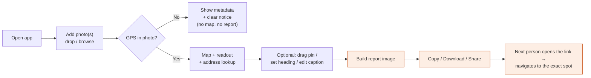
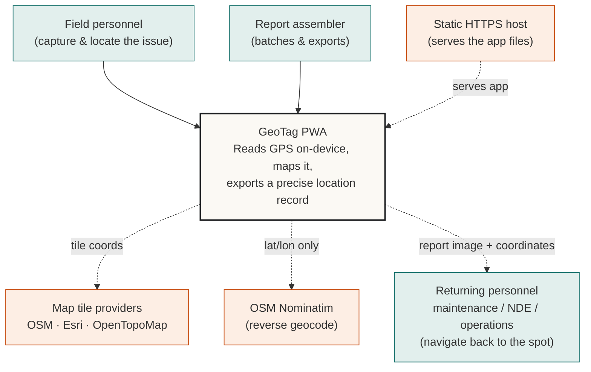
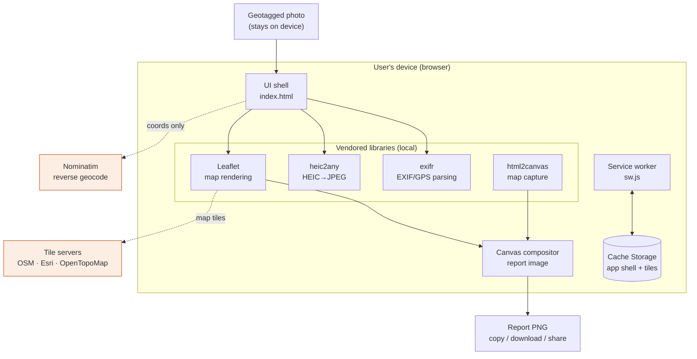
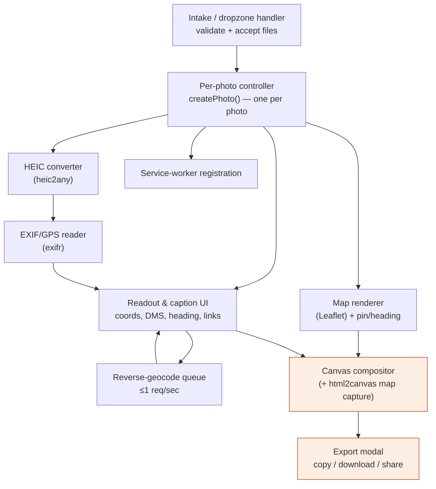
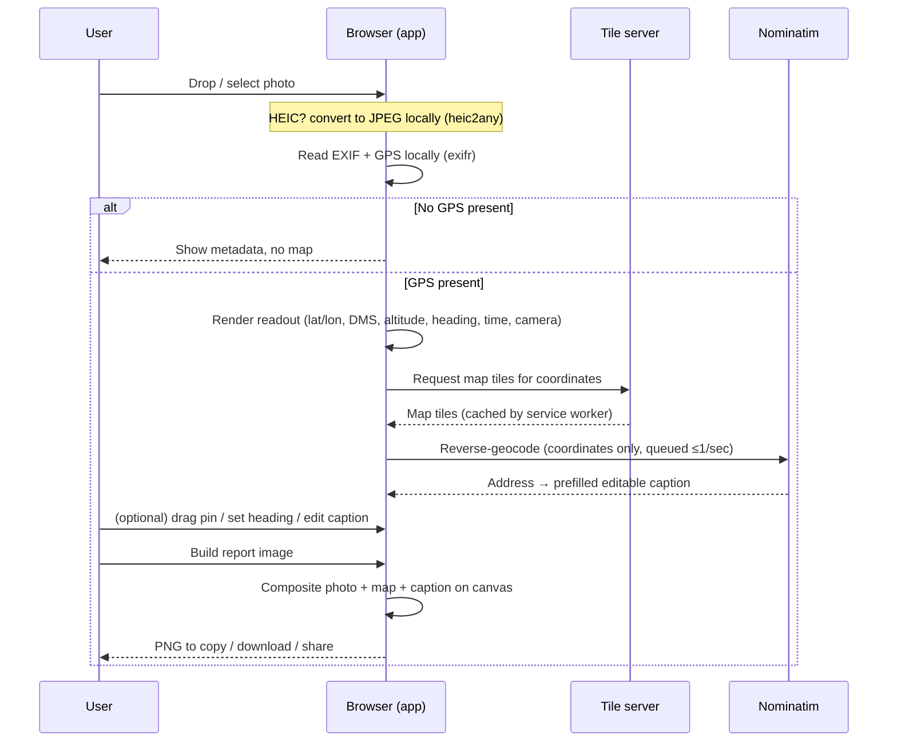
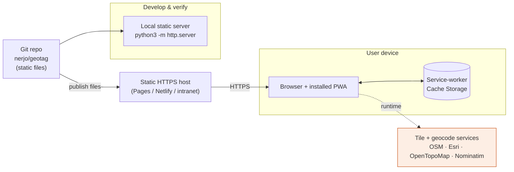

# GeoTag · Field Inspection Mapper

## Design & Architecture Document

| | |
|---|---|
| **Document status** | For review — IT & Digital Services |
| **Application** | GeoTag · Field Inspection Mapper |
| **Type** | Progressive Web App (PWA), client-side only |
| **Repository** | `nerjo/geotag` |
| **Version / build** | Service-worker cache `geotag-v2` |
| **Last updated** | 16 June 2026 |
| **Author** | Application owner, with Claude Code (AI pair-programmer) |

> **How to read this document.** Sections 1–10 are the **design** view (purpose,
> users, journeys, screens, visual system, accessibility) written for a general
> stakeholder audience. Sections 11–17 are the **architecture** view (system,
> data, hosting, security) for a technical/IT audience. Sections 18–21 cover
> **known limits, decisions (ADRs), and roadmap**. A one-page reviewer summary is
> at the end (§21).

### Contents

**Design**
1. Executive overview
2. Website purpose & the stakeholder problem
3. Stakeholders & user groups
4. Main user journeys & top actions
5. Key features
6. Page / view-by-view design
7. Visual design system
8. Usability & design decisions
9. Interaction states & error handling
10. Accessibility & device support

**Architecture**
11. System architecture overview
12. Technology stack
13. Data flow, storage & privacy
14. Security, privacy & risk register
15. Offline & Progressive Web App design
16. Hosting, deployment & operations
17. How the application was built

**Decisions & outlook**
18. Known limits & out of scope
19. Architecture Decision Records (ADRs)
20. Implementation Internally & future roadmap
21. Summary for reviewers

---

# Design

## 1. Executive overview

GeoTag is a lightweight, installable web application that lets field personnel turn
a geotagged photograph into a **precise, shareable record of *where* something is**
— so the next person who has to go there can find the exact spot — without
uploading the photograph anywhere.

A user drops one or more photos onto the page. For each photo the app reads the
embedded GPS metadata **in the browser**, plots the location on an interactive
map, looks up a human-readable address, and produces a side-by-side
**photo + map** image with a coordinate caption. That artefact can be copied,
downloaded, or shared into a report, a work order, or a message so the recipient
can navigate straight to the location — and it works just as well for an
inspection report as for any other field hand-off.

The defining architectural characteristic is **privacy by design**: photographs
and their coordinates are processed entirely on the user's device. The only
network traffic is for map tiles and an optional address lookup — never the
photo itself. The app is a single static HTML file with vendored libraries, so it
has **no backend, no database, no user accounts, and no server-side data
storage**. It runs fully offline once installed.

This document describes the design, the user experience, the technology choices,
the data-flow and privacy posture relevant to an IT/security review, the
deployment model, the key decisions taken (as ADRs), and — at the request of the
business — **how the application was built collaboratively** with an AI
pair-programmer.

---

## 2. Website purpose & the stakeholder problem

### 2.1 The problem it solves

Field personnel routinely photograph a piece of equipment, a defect, or a
developing issue out in the plant. Almost every one of those photos already carries
the **exact GPS location** of where it was taken — but that location data normally
stays locked inside the image file and is never put to use.

So the equipment's physical location ends up being communicated to the next person
in *words*: a written description, nearby landmarks, or a rough bearing such as
"northeast corner of Plant 12." Whoever later has to **return to that exact spot**
— a maintenance technician sent to fix the leak, an NDE technician performing a
follow-up inspection, or operations personnel asked to monitor the equipment across
shifts — then has to interpret that description and hunt for the location. That is
slow, ambiguous, inconsistent between staff, and easy to get wrong.

GeoTag closes this gap. It reads the photograph's own GPS data **on the device**
and turns it into a precise, shareable location: an interactive map, exact
coordinates, and a side-by-side photo + map artefact that points the next person
straight to where the photo was taken — with one-tap links to open the spot in a
phone's map app for turn-by-turn navigation.

Although it grew out of inspection work, the tool is **not limited to inspection
reports**. It serves any field workflow where one person needs to show another
exactly where something is and that second person will eventually have to go find
it — fixing it, re-inspecting it, monitoring it, or simply confirming a concern.
And because the image is processed entirely on the device, it keeps potentially
sensitive site imagery off external servers.

### 2.2 The stakeholder problem

| Stakeholder | The problem they have today | How GeoTag addresses it |
|---|---|---|
| **Field personnel capturing the issue** (inspectors & others) | Can only convey a photographed item's location in words, landmarks, or a rough bearing — imprecise, slow, and inconsistent between staff. | Captures the photo's actual coordinates plus a map the recipient can navigate to. |
| **Personnel who must return to the location** (maintenance, NDE, operations) | Must interpret a vague written description and then search the plant to find the exact equipment again. | Receive exact coordinates + map + photo, and can open the spot directly in a map app. |
| **IT & Security** | Field tools that upload imagery to external/consumer cloud services create data-governance and breach exposure. | No upload, no backend, no accounts — minimal attack surface to assess. |
| **Digital Services / delivery** | Building and operating a bespoke app is costly (servers, auth, patching). | A static, serverless app with near-zero operational footprint. |
| **Records / compliance** | Location claims in reports are hard to verify and easy to mis-transcribe. | Coordinates are read from the photo and rendered into the artefact verbatim, with an explicit flag if the pin was manually adjusted. |

### 2.3 Design goals

1. **Privacy first** — image data must never leave the device.
2. **Zero install friction** — works from a URL; installable without an app store.
3. **Works in the field** — fully functional offline after first load.
4. **Actionable, shareable output** — a clean photo + map + coordinates the next
   person can navigate to (drops straight into a report, work order, or message).
5. **No operational backend** — nothing to host, patch, or breach server-side.

---

## 3. Stakeholders & user groups

GeoTag has a small number of distinct user types. Each row states what that user
needs to *accomplish* with the app.

| User group | Who they are | What they need to accomplish | Primary surface |
|---|---|---|---|
| **Field personnel** (inspectors & others) | On-site staff capturing a photo of an issue or piece of equipment, often on a phone, sometimes offline. | Drop a just-taken photo, confirm the location is right (and nudge it if not), and produce a precise location record to hand off. | Mobile PWA, single-column. |
| **Returning personnel** (maintenance / NDE / operations) | Whoever must physically go back to the photographed location later — to fix, re-inspect, or monitor it. | Find the exact spot from the shared coordinates and map, and open it in a map app for navigation. | Receives the report image / coordinates; uses the "Open in maps" links. |
| **Report assembler / back-office** | Office staff packaging the location records into reports or work orders, usually on desktop. | Batch-process several photos, copy/download each report image into a document. | Desktop, two-column, multi-photo. |
| **IT / security reviewer** | Assesses the tool before rollout. | Understand data handling, egress, hosting, and risk. | This document. |
| **Application owner / maintainer** | Owns the product and future changes. | Extend features, update dependencies, redeploy. | Source repo + this document. |

There are **no authenticated roles, no admin panel, and no per-user
configuration** — every user sees the same single-purpose tool. This is
deliberate (see ADR-001, ADR-006).

---

## 4. Main user journeys & top actions

### 4.1 Top three actions

The interface is optimised around three actions, in priority order:

1. **Add photo(s)** — drag-and-drop or browse.
2. **Confirm / correct the location** — read the coordinates, optionally drag the
   pin and set the heading, edit the caption.
3. **Build & take the report image** — copy, download, or share.

### 4.2 Primary journeys

Every journey ends in an artefact whose job is to get the **next person to the
exact location** — so the journeys span both creating the record and acting on it.

**Journey A — Single photo (mobile, in the field).**
Open app → drop one photo → app reads GPS and shows the map and readout → (optional)
drag pin / set heading / edit caption → tap **Build report image** → **Copy** or
**Share** into the report. Works offline for previously viewed map areas.

**Journey B — Batch (desktop, back-office).**
Open app → drop several photos → each gets its own card, map, and report button →
switch map style once (applies to all) → per card, adjust and **Build report
image** → **Download PNG** for each → assemble into the report document.

**Journey C — Correcting a bad fix.**
Photo has GPS drift → drag the pin to the true location → the readout updates live,
the address re-looks-up, and the card/report is flagged **"manually adjusted"** so
the correction is transparent in the evidence.

**Journey D — Photo without GPS.**
Drop a photo with no GPS → app shows the available metadata (camera, capture time)
and a clear notice, hides the map, and disables the report button — no dead-ends.

**Journey E — Returning to the location (the recipient).**
A maintenance, NDE, or operations colleague receives the report image (or just the
coordinates) → opens the **"Open in Google / Apple / OpenStreetMap"** link, or reads
the coordinates → navigates straight to the exact spot where the photo was taken,
instead of decoding a worded description. This is the payoff the other journeys feed.



---

## 5. Key features

| Feature | Description |
|---|---|
| **On-device EXIF/GPS read** | Latitude/longitude (decimal & DMS), altitude, heading, capture time, and camera make/model parsed from the photo in the browser. |
| **Multi-photo workspace** | Any number of photos can be added; each gets its own card, map, and report button. |
| **Interactive map** | Leaflet map with **Street** (OpenStreetMap), **Satellite** (Esri World Imagery), and **Topo** (OpenTopoMap) styles. |
| **Reverse geocoding** | Optional human-readable address from OpenStreetMap Nominatim, auto-filled into an editable caption. |
| **Draggable pin** | The location pin can be nudged to correct GPS drift; the report is flagged as *"manually adjusted"* when this happens. |
| **Heading / direction cone** | Camera-pointing direction shown as a cone on the map; pre-filled from EXIF or set by hand. |
| **HEIC support** | iPhone `.heic` photos are converted to a viewable JPEG in-browser. |
| **Report image export** | Composited photo + map PNG with coordinate caption and product footer, rendered on a `<canvas>`. |
| **Copy / Download / Share** | Output can be copied to clipboard, downloaded as PNG, or shared via the native OS share sheet. |
| **Installable PWA** | Adds to home screen / desktop; launches in its own window. |
| **Offline-capable** | App shell, libraries, and fonts are precached; previously viewed map tiles are cached too. |

---

## 6. Page / view-by-view design

GeoTag is a **single-page application** — one URL, one screen, no navigation
between pages. What changes is which *views* are visible. Each view below lists
its purpose and the **information hierarchy** (what the user should see first,
second, and last).

### 6.1 Masthead / header (always visible)
- **Purpose:** identity and the privacy promise.
- **First:** the GeoTag wordmark and "Field Inspection Mapper" descriptor.
- **Second:** the **`100% LOCAL`** privacy tag.
- **Last:** the one-line explanation that photos are read in-browser and never
  uploaded.

### 6.2 Dropzone / intake (initial state)
- **Purpose:** the single call-to-action — get a photo in.
- **First:** the large drop target with the 📍 icon and "Drop geotagged photos
  here".
- **Second:** the accepted formats line (JPG · PNG · HEIC · add as many as you
  like).
- **Last:** the **Browse files** button for users who prefer a file picker.

### 6.3 Workspace toolbar (after first photo)
- **Purpose:** controls that apply across all photos.
- **First:** the **map-style** segmented control (Street / Satellite / Topo).
- **Second:** the **photo count**.
- **Last:** **Clear all**.

### 6.4 Per-photo card (the core working view)
One card per photo; the heart of the app.
- **First:** the card header — photo number, filename, and a remove (✕) control.
- **Second:** the **photo** (left/top) and the **map** with the location pin
  (right/bottom) side by side, so the user immediately sees *"this photo →
  this place"*.
- **Then:** the **readout** — coordinates (decimal & DMS), altitude, editable
  **heading**, capture time, camera, the editable **caption**, and "Open in"
  map links.
- **Last:** the **Build report image** button (the card's primary action) and a
  per-card status line.

### 6.5 Export modal (on Build)
- **Purpose:** preview and take the finished artefact.
- **First:** the rendered **report image** preview.
- **Second:** the take-away actions — **Copy image**, **Share** (when supported),
  **Download PNG**.
- **Last:** the close control. Dismissible by ✕, backdrop click, or `Esc`.

### 6.6 Ambient feedback — status banner & toast
- **Status banner** (under the dropzone, and per card): inline progress and
  errors, colour-coded (ok / warn / error) with a spinner while working.
- **Toast:** brief confirmations ("Copied ✓", "Downloaded ✓") that auto-dismiss.

---

## 7. Visual design system

### 7.1 Visual style & the message it sends
The aesthetic is a **field instrument / surveyor's document**: a warm paper
background with a faint blueprint grid, precise monospaced labels, framed corner
ticks on the masthead, and a single hi-vis safety-orange accent. The intended
message is **"a precise, trustworthy professional tool"** — closer to a calibrated
instrument or an official form than a consumer photo app — which reinforces the
credibility of the evidence it produces.

### 7.2 Colour palette (CSS custom properties, `index.html` `:root`)
| Token | Value | Use |
|---|---|---|
| `--paper` | `#ece7dc` | App background (with blueprint grid) |
| `--card` | `#fbf9f4` | Card / panel surfaces |
| `--ink` | `#1a1c1e` | Primary text & strong borders |
| `--ink-soft` / `--ink-faint` | `#52555b` / `#8b8e94` | Secondary / tertiary text |
| `--line` / `--line-strong` | `#d8d2c4` / `#c2bba9` | Dividers & borders |
| `--accent` / `--accent-deep` | `#ef5d12` / `#c54405` | Hi-vis surveyor orange (primary action, pin) |
| `--good` | `#15706b` | Success states |

Colour is used sparingly: orange marks *action and location*; teal marks
*success*; red marks *errors*. The map pin and direction cone reuse the same
orange so the brand and the data point are visually unified.

### 7.3 Typography
- **IBM Plex Sans** — body and controls.
- **IBM Plex Sans Condensed** — the wordmark and section headings (uppercase,
  tracked-out) for an "official document" feel.
- **IBM Plex Mono** — all data values, field labels, coordinates, and captions, so
  numbers align and read as instrument output. Fonts are self-hosted woff2 (no
  third-party font CDN).

### 7.4 Spacing, shape & elevation
Consistent radius (`--radius: 14px`) on cards/panels, a shared soft shadow token,
and generous padding. A 30px blueprint grid underlies the page. Layout is a
centred shell capped at ~1080px on desktop.

### 7.5 Components & repeating interface patterns
The same handful of patterns repeat everywhere, which keeps the app learnable:
- **Cards** — every photo is a bordered card with a numbered header.
- **Panes with mono headers** — the photo and map each sit in a pane with a small
  uppercase mono label and a status dot.
- **Segmented control** — the map-style switch.
- **Buttons** — three weights: solid dark (default), **accent orange** (primary:
  Build / Download), and ghost (secondary: Clear all / Share).
- **Copy buttons** — a small icon button beside any copyable value (coordinates).
- **Status pills** — colour-coded inline banners with an optional spinner.
- **Toast** — transient confirmation.
- **Form fields** — caption textarea and numeric heading input share the same
  bordered, mono, orange-focus styling.
- **Icons** — line-style SVG (the crosshair glyph, copy, pin), matching the
  instrument theme.

---

## 8. Usability & design decisions

### 8.1 Choices that reduce confusion
- **One primary action at a time** — a big single dropzone to start; per card, a
  single accent **Build report image** button.
- **Immediate spatial proof** — photo and map are shown together so the user never
  has to imagine the link.
- **Plain-language privacy** stated up front, removing the "is my photo being
  uploaded?" doubt.
- **Honest state** — a manually moved pin is labelled *adjusted* on screen and in
  the report rather than silently overriding the EXIF location.
- **No dead-ends** — missing GPS, wrong file types, and offline lookups all return
  a clear message and a still-usable screen.

### 8.2 Choices that make it easier on **mobile**
- Single-column layout below 760px; the map fixes to a usable 300px height.
- The action bar becomes **sticky at the bottom** with full-width buttons, so
  *Build* is always in thumb reach.
- Native **Share** is offered when the device supports it.
- `viewport-fit=cover` and safe-area insets respect notches/home indicators.
- Installable to the home screen; launches full-screen like a native app.

### 8.3 Choices that make it easier on **desktop**
- Two-column **photo + map** side-by-side; the map height tracks the photo height
  (via a `ResizeObserver`) so the pair stays balanced.
- Wider shell (up to 1080px) and a right-aligned action row.
- Keyboard support (drop target is focusable and `Enter`/`Space` activates it;
  `Esc` closes the modal).
- Hover affordances on buttons and copy controls.

### 8.4 What is intentionally simple, and why
- **No accounts, settings, or navigation** — the tool does one job; configuration
  would add cognitive load and a data-storage surface for no benefit (ADR-006).
- **No framework or build step** — keeps the app a single auditable file and the
  smallest possible attack surface (ADR-002).
- **One artefact type (PNG)** — universally paste-able into any report tool; richer
  formats are deferred (see §20).

---

## 9. Interaction states & error handling

### 9.1 What each action triggers
| User action | Feedback / state |
|---|---|
| Drop / select photo | **Upload + loading** — "Reading image…" with spinner; HEIC shows "Converting HEIC…". |
| GPS found | **Success** — "GPS location found"; map and readout render. |
| Address lookup running | Caption placeholder shows "Looking up address…"; fills when ready. |
| Build report image | **Loading** — button shows "Rendering…"; then the **export modal** (a confirmation/preview) opens. |
| Copy image | **Confirmation toast** — "Image copied ✓". |
| Download PNG | **Download** triggered + "Downloaded ✓" toast. |
| Share | Hands off to the native OS share sheet (only shown when supported). |
| Remove card / Clear all | Card(s) removed; workspace collapses when empty. |

There are **no "saved results"** to manage — nothing persists between sessions by
design (see §13.2).

### 9.2 When the user makes a mistake
- **Wrong file type:** non-image files are filtered; if none are valid, an error
  banner says "Please choose JPG, PNG or HEIC files"; a partial batch shows "Some
  files were skipped".
- **Pin dragged wrongly:** simply drag again; the *adjusted* flag and live readout
  keep it honest; the original EXIF location is retained internally.
- **Closed the modal by accident:** the card and its **Build report image** button
  remain; nothing is lost.

### 9.3 When data is missing, invalid, or incomplete
- **No GPS in the photo:** warning banner "No GPS data in this photo — showing
  available metadata"; the map pane is removed and the report button disabled, but
  camera/time metadata still shows.
- **Unreadable/corrupt image:** "Could not process this image. Try another file."
- **Address lookup fails or offline:** the caption falls back to a typed-caption
  prompt ("Address lookup unavailable (offline) — type a caption"); coordinates and
  map are unaffected.
- **Map capture fails during export:** the report still renders with a "map
  unavailable" placeholder rather than failing the whole image.
- **Clipboard/Share unsupported:** copy falls back to "Copy not supported — use
  Download".

---

## 10. Accessibility & device support

### 10.1 Target standard
The app targets **WCAG 2.1 Level AA** as the design baseline. Current
implementation includes several AA-supporting measures (below); a formal
conformance audit is listed as outstanding work (§18, §20).

### 10.2 What is implemented today
- **Semantic roles & labels:** the dropzone uses `role="button"`,
  `aria-label="Upload photos"`; the map-style switch uses `role="radiogroup"` with
  an `aria-label`; the workspace is an `aria-live="polite"` region so status
  changes are announced.
- **Labelled controls:** action buttons carry `aria-label`/`title` (e.g. "Remove
  photo", "Copy", "Close"); the photo `` has descriptive `alt` text.
- **High contrast:** dark ink on warm paper; the orange accent is used with dark
  borders/text rather than as the sole signal.
- **Focus styles:** inputs show an orange focus border; controls are reachable.

### 10.3 Keyboard-only use
- The drop target is focusable (`tabindex="0"`) and activates on **Enter/Space**.
- **Browse files**, buttons, links, and form fields are standard focusable
  elements.
- The export modal closes on **Esc** (and backdrop click).
- *Known gap:* the modal does not yet trap focus, and the Leaflet map's full
  keyboard panning is not customised — see §18.

### 10.4 Screen-reader labelling of images, icons, maps, buttons, fields
- Photos have `alt` text; decorative icons are marked `aria-hidden`.
- Buttons and the copy controls have text or `aria-label`s.
- *Known gap:* the **map** is a visual control; its pin/coordinate state is
  available as text in the readout, but the interactive map itself is not fully
  described to assistive tech. The coordinate readout is the accessible equivalent.

### 10.5 Smallest expected phone size
Layout is verified to remain usable down to a **~320px-wide** viewport (single
column, sticky full-width action bar, 300px map). Safe-area insets handle notched
devices.

### 10.6 Browsers & devices supported
Current evergreen browsers on desktop and mobile (Chrome, Edge, Safari, Firefox).
Uses widely-supported platform features: File API, Canvas, Service Workers,
Clipboard and Web Share where available (Share is feature-detected and hidden when
unsupported). Installable on iOS/iPadOS (Safari → *Add to Home Screen*), Android
(Chrome → *Install app*), and desktop Chrome/Edge.

---

# Architecture

## 11. System architecture overview

GeoTag is a **single-page, client-side static application**. There is no
application server — the "backend" is simply a static file host plus a small
number of third-party tile/geocoding services called directly from the browser.

### 11.1 System context (C4 — level 1)



### 11.2 Containers (C4 — level 2)



### 11.3 Components (C4 — level 3, inside `index.html`)



### 11.4 Logical layers
1. **Presentation / shell** — `index.html` contains the markup, an inline CSS
   design system, and the application logic in a single IIFE.
2. **Processing libraries** — four vendored libraries (see §12) handle EXIF
   parsing, HEIC decoding, map rendering, and DOM-to-canvas capture.
3. **Compositor** — a `<canvas>` routine draws the photo, a clean off-screen map,
   the pin/heading cone, and the caption into the final report image.
4. **Offline layer** — `sw.js` precaches the app shell and runtime-caches tiles.

### 11.5 Per-photo component model
Each uploaded photo is handled by an isolated `createPhoto()` instance owning its
own card DOM, Leaflet map, marker, and state object
(`{lat, lon, heading, caption, pinMoved, …}`). Instances are tracked in a single
`photos[]` array. Global controls — map-style switch, *Clear all*, window resize —
fan out to every instance. This keeps multi-photo behaviour predictable without a
framework or shared mutable global state.

---

## 12. Technology stack

GeoTag deliberately uses **no build step and no framework**. It is plain
HTML/CSS/JavaScript, served as static files. All third-party code is **vendored**
(committed into `vendor/`) rather than loaded from a CDN, which guarantees offline
operation and removes runtime dependency on external script hosts.

| Component | Version | Purpose | Licence |
|---|---|---|---|
| **Leaflet** | 1.9.4 | Interactive map rendering | BSD-2-Clause |
| **exifr** | (vendored UMD) | EXIF / GPS metadata parsing | MIT |
| **html2canvas** | 1.4.1 | Capture the live map into the export canvas | MIT |
| **heic2any** | (vendored) | Convert HEIC photos to JPEG in-browser | MIT |
| **IBM Plex** fonts | — | Sans / Sans Condensed / Mono (self-hosted woff2) | SIL OFL 1.1 |

> **Note for IT:** all of the above are permissively licensed (MIT / BSD / OFL)
> and are pinned and vendored. There is no `npm install`, no transitive dependency
> tree resolved at build time, and no package registry in the runtime path.

**Why no framework / no build:** the app is small enough that a framework would add
more weight than it saves; a single static file is trivially auditable, trivially
hosted, and has the smallest possible attack surface; and there is no build-time
supply-chain step to secure. (Recorded as ADR-002.)

---

## 13. Data flow, storage & privacy

### 13.1 Lifecycle of a single photo



### 13.2 What data is collected, where it lives, and for how long
| Data | Collected? | Where it is processed | Storage / retention | Leaves device? |
|---|---|---|---|---|
| Photograph (pixels) | Read locally, **not collected by any server** | In-browser only | In memory for the session; object URLs revoked on removal | **No** |
| EXIF / GPS metadata | Read locally | In-browser only | In-session memory only | **No** (except coordinates, below) |
| Coordinates (lat/lon) | — | In-browser | In-session memory only | **Only** to the chosen tile server and Nominatim, to fetch a map and an address |
| Address (geocode result) | Received | In-browser | In-session memory only | No (received) |
| Map tiles | Cached | Service worker | **Cache Storage**, capped at 300 tiles, oldest trimmed | Imagery received from tile host |
| App shell / libraries / fonts | Cached | Service worker | Cache Storage until cache version bumped | No |
| Final report image | Generated | In-browser | Not stored — exists until the user copies/downloads/shares | No, until the user chooses to |

**Nothing user-entered persists between sessions.** There are no cookies, no
`localStorage`/`IndexedDB` of user content, no accounts, and no analytics. The only
browser storage used is the service-worker **Cache Storage** (static assets + map
tiles), which holds no personal data beyond imagery of areas the user viewed.

### 13.3 What the website can create (outputs)
A single artefact type: a **PNG report image** per photo (photo + map + coordinate
caption + product footer), produced on-device and taken away via copy / download /
share. No files are written server-side.

### 13.4 What still requires an internet connection
- **Fresh map tiles** for areas not already cached (previously viewed areas work
  offline).
- **Reverse geocoding** (address) — online only; absence degrades to a typed
  caption.
Everything else — reading GPS, plotting cached areas, pin/heading editing, and
building/exporting the report — works fully offline.

### 13.5 Network egress (the complete list)
| Host | Purpose | Data sent |
|---|---|---|
| `tile.openstreetmap.org` | Street map tiles | Tile coordinates (derived from location) |
| `server.arcgisonline.com` | Esri satellite tiles | Tile coordinates |
| `tile.opentopomap.org` | Topographic tiles | Tile coordinates |
| `nominatim.openstreetmap.org` | Reverse geocode (address) | Latitude/longitude only |

There are **no other endpoints** and **no first-party backend**. If these hosts are
blocked, the app still reads photos and shows coordinates; only map imagery and
address lookup degrade gracefully.

---

## 14. Security, privacy & risk register

### 14.1 Client-side security characteristics
- **Safe rendering:** all user- and EXIF-derived strings are HTML-escaped before
  DOM insertion (`esc()`), mitigating XSS from malicious file metadata.
- **CORS-clean canvas:** tiles are requested with CORS and cached as-is so the
  export canvas is never "tainted", keeping copy/download/share working.
- **No `eval`, no dynamic remote script:** all executable code is the vendored,
  reviewable libraries plus inline logic; nothing is fetched and executed at
  runtime.
- **Graceful failure:** missing libraries, missing GPS, failed conversions, and
  offline geocoding all produce a clear message rather than a broken state.

### 14.2 Environment, secrets & configuration
- **No environment variables, secrets, or API keys are required** for the default
  tile and geocoding providers. There is nothing to rotate or leak.
- Configuration that exists is **source-level constants**: the tile/geocode URLs in
  `index.html` and the cache version + tile hosts in `sw.js`.

### 14.3 Security risks
| Risk | Assessment / mitigation |
|---|---|
| **Third-party script trust** (vendored libs) | Pinned, vendored, reviewable; update only deliberately. Supply-chain risk is at *update time*, not runtime. |
| **Host compromise / asset tampering** | Mitigated by HTTPS + recommended strict **CSP** (§16.5); all scripts are same-origin. |
| **Malicious image metadata** | Escaped on output; parsing is sandboxed to the browser. |
| **Clickjacking** | Mitigated by recommended `X-Frame-Options`/`frame-ancestors` headers. |

### 14.4 Privacy risks
| Risk | Assessment / mitigation |
|---|---|
| **Coordinates exposed to third parties** | Map tiles and Nominatim necessarily receive location (as tile coords / lat-lon) and the device IP. This is the *only* data that leaves the device. Mitigation: repoint to org-hosted/commercial providers (ADR-004/005, §20). |
| **Cached map imagery on shared devices** | Cache Storage retains viewed tiles; clearable via the browser / "Clear site data". No personal content is cached. |
| **Accidental over-share of the report** | The report is created locally; the user controls when/where it goes. |

### 14.5 Failure points
| Failure point | Effect | Behaviour |
|---|---|---|
| Tile server unavailable | No fresh map imagery | Cached tiles still serve; export shows "map unavailable" placeholder if needed. |
| Nominatim unavailable | No auto-address | Caption falls back to manual entry. |
| `html2canvas` map capture fails | — | Report still renders with placeholder map. |
| HEIC conversion fails | That photo not displayed | Clear per-card error; other photos unaffected. |
| Clipboard/Share API absent | Can't copy/share | Falls back to Download. |
| Service worker unsupported/blocked | No offline | App still works online. |

---

## 15. Offline & Progressive Web App design

GeoTag is a fully installable PWA defined by `manifest.webmanifest` (name, icons,
theme colour, standalone display) and powered by the `sw.js` service worker.

**Caching strategy:**
- **App shell — cache-first.** On install the service worker precaches everything
  needed to open with no network: `index.html`, all vendored libraries, fonts, and
  icons (`SHELL_ASSETS`). Navigations fall back to cached `index.html` offline.
- **Map tiles — stale-while-revalidate, capped.** Tiles serve from cache
  immediately and refresh in the background into a separate cache capped at **300
  tiles** (oldest trimmed) so storage stays bounded.
- **Everything else (e.g. Nominatim) — pass-through**, uncached; degrades
  gracefully.

**Versioning / updates:** the cache name carries a version
(`CACHE_VERSION = "geotag-v2"`). Bumping it on any asset change installs a fresh
shell cache and deletes stale caches on activation, so clients pick up new builds
cleanly.

---

## 16. Hosting, deployment & operations

### 16.1 Hosting model
GeoTag is a set of **static files** served from the repository root, hostable on
essentially any static host: GitHub Pages, Netlify, Cloudflare Pages, Azure Static
Web Apps, S3 + CloudFront, or an internal static web server / intranet share over
HTTPS. There is **no runtime, no server process, no database, and no scheduled
job**. Operationally: "deploy the files and serve them over HTTPS." 

### 16.2 Source code & project layout
Source is stored in the Git repository **`nerjo/geotag`**.
```
index.html              App shell, design system, and all logic
manifest.webmanifest    PWA metadata (name, icons, theme)
sw.js                   Service worker (offline shell + tile cache)
vendor/                 Vendored, offline-capable libraries & fonts
  leaflet/  exifr/  html2canvas/  heic2any/  fonts/
icons/                  App icons (192 / 512 / maskable / apple-touch / favicon)
docs/                   This document (Markdown + PDF)
README.md               Quick start & install notes
```

### 16.3 Build, test & deploy
- **Build:** none — there is no compile/bundle step; the files are shipped as-is.
- **Test:** validation is currently **manual** — exercised with real geotagged,
  no-GPS, and HEIC photos across desktop and mobile, plus offline checks. There is
  **no automated test suite yet** (noted in §18/§20). The PDF of this document is
  generated from the Markdown via a headless-Chrome toolchain.
- **Deploy:** copy the repo contents to the static host over HTTPS; bump
  `CACHE_VERSION` in `sw.js` when any precached asset changes.

### 16.4 Deployment view



### 16.5 Recommended deployment hardening
- Serve over **HTTPS** (required for service workers and clipboard/share APIs).
- Apply a strict **Content-Security-Policy** (`script-src 'self'`,
  `connect-src`/`img-src` limited to the four hosts in §13.5 plus `data:` for the
  inline pin imagery). Because all scripts are same-origin, a strict CSP is
  straightforward.
- Standard static headers (HSTS, `X-Content-Type-Options: nosniff`,
  `Referrer-Policy`, `X-Frame-Options`/`frame-ancestors`).

### 16.6 Maintenance
- **Dependency updates** are manual and intentional: replace the file under
  `vendor/`, re-test, bump `CACHE_VERSION`. No automated dependency drift.
- **Small surface** — one HTML file plus four vendored libraries — keeps review
  cheap. **No secrets** are embedded.

---

## 17. How the application was built

At the business's request, this section documents *how* GeoTag was created, because
the working method is itself notable: it was built as a **human–AI collaboration**,
with the application owner directing the product and **Claude Code** (an agentic
coding assistant) acting as a pair-programmer that wrote, refined, and explained the
implementation.

### 17.1 The working method
Development was **conversational and iterative**, in short cycles:
1. **Describe the intent** in plain language ("read a photo's GPS on-device and show
   it on a map", "let me drag the pin to correct it", "export a report image").
2. **The AI implemented it** directly in the codebase and explained the trade-offs
   (e.g. why EXIF is read from the *original* file even after HEIC conversion,
   because conversion can strip metadata).
3. **Review on real behaviour** — the owner tried it with real photos; adjustments
   came in the next cycle.

### 17.2 How the product grew (from version history)
| Step | Commit | What it added |
|---|---|---|
| 1 | *Initial commit* | Project scaffold. |
| 2 | *Base standalone app* | On-device GPS read, map, and export. |
| 3 | *Captions, draggable pin, heading control, report notes* | Editable caption (auto-filled from reverse geocoding), pin-drag correction with an "adjusted" flag, heading/direction control. |
| 4 | *Multiple photos, each with its own report button* | The multi-photo workspace and per-photo report generation. |

Core capability first, then field-usability refinements, then scale to many photos —
mirroring how the requirements were understood through use.

### 17.3 Why this matters for IT & Digital Services
- **Transparency** — the entire app is human-readable source in one repository; no
  opaque compiled artefact or hidden service.
- **Maintainability** — small, commented, framework-free code, extendable by a
  developer or by continuing the same AI-assisted workflow.
- **Auditability of method** — the incremental git history is a reviewable record of
  how each capability was introduced.

---

# Decisions & outlook

## 18. Known limits & out of scope

### 18.1 Known limitations of the current version
- **No automated tests** — validation is manual (§16.3).
- **Accessibility gaps** — no focus-trap in the modal; the interactive map is not
  fully described to assistive tech (the coordinate readout is the accessible
  equivalent); no formal WCAG audit yet.
- **Third-party tile/geocode dependency** — default providers are public community
  services with their own usage policies and no SLA.
- **One output format** — PNG only; no combined/multi-photo or PDF export.
- **Single-pin reverse geocoding rate** — Nominatim is queried ≤1/sec, so large
  batches fill addresses gradually.
- **No persistence** — closing the tab discards the working set (by design).

### 18.2 Explicitly out of scope (right now)
User accounts/auth, server-side storage or a database, analytics/telemetry,
editing/annotating the photo itself, and integration into downstream
asset/inspection systems.

### 18.3 Design choices that may need stakeholder approval
- **Use of public OSM/Esri/OpenTopoMap/Nominatim services** vs. an org-hosted or
  commercial provider (data-egress / usage-policy / SLA decision). 
- **Internal hosting location & approval** — an approved static-hosting
  location and HTTPS endpoint (see §20.1).
- **Branding** of the report image (logo/footer) for official use.
- **Accessibility conformance level** to be formally certified.
- **Retention/clearing policy** for cached map imagery on shared devices.

### 18.4 Future changes that would force architecture changes
Anything that breaks the "no backend" premise: saving/sharing reports server-side,
multi-user collaboration or accounts, centralised audit logging, or server-side PDF
generation would introduce a backend, storage, and authentication — a materially
different architecture and security profile.

---

## 19. Architecture Decision Records (ADRs)

Each record captures the decision, context, options, rationale, trade-offs, risks,
and status.

### ADR-001 — Client-side only, no backend
- **Decision:** process everything in the browser; ship no server/API/database.
- **Context:** the core requirement is that photos never leave the device.
- **Options:** (a) client-only; (b) thin backend for geocoding/storage; (c) full
  SaaS with accounts.
- **Rationale:** (a) is the only option that structurally guarantees the privacy
  promise and removes server-side breach/operations cost.
- **Trade-offs:** no server-side persistence, audit, or cross-device sync.
- **Risks:** features needing shared state require re-architecture (§18.4).
- **Status:** Accepted (owner).

### ADR-002 — No framework, no build step (single-file app)
- **Decision:** plain HTML/CSS/JS in one file; no bundler/framework.
- **Context:** small, single-purpose tool; auditability and minimal attack surface
  prioritised.
- **Options:** React/Vue + bundler; lightweight framework; vanilla single file.
- **Rationale:** the app is small enough that a framework adds more weight and
  supply-chain surface than it saves; one file is trivially auditable and hosted.
- **Trade-offs:** less structure for large future growth; manual DOM code.
- **Risks:** if scope grows substantially, maintainability could suffer.
- **Status:** Accepted (owner).

### ADR-003 — Vendored libraries instead of CDN
- **Decision:** commit Leaflet/exifr/html2canvas/heic2any/fonts into `vendor/`.
- **Context:** must work fully offline and not depend on external script hosts.
- **Options:** CDN-loaded libraries; vendored libraries.
- **Rationale:** vendoring guarantees offline operation, pins versions, and removes
  runtime third-party script trust.
- **Trade-offs:** updates are manual; repo is larger.
- **Risks:** vendored copies can drift from upstream security fixes if not tracked.
- **Status:** Accepted (owner).

### ADR-004 — Map providers: Leaflet + OSM / Esri / OpenTopoMap
- **Decision:** render with Leaflet; offer OSM, Esri World Imagery, OpenTopoMap
  tiles.
- **Context:** need free, key-less, multi-style maps that keep the export canvas
  CORS-clean.
- **Options:** commercial SDKs (Google/Mapbox, require keys/billing); open tiles +
  Leaflet.
- **Rationale:** open tiles need no API keys/secrets and cover street/satellite/
  topo; Leaflet is small, permissively licensed, and CORS-friendly.
- **Trade-offs:** public tiles have usage policies and no SLA.
- **Risks:** availability/rate limits; coordinates + IP exposed to tile hosts.
- **Future work:** repoint to org-hosted/commercial tiles (small code change).
- **Status:** Accepted (owner); provider choice flagged for stakeholder approval.

### ADR-005 — Reverse geocoding via OSM Nominatim (online-only, coordinates-only)
- **Decision:** look up addresses from Nominatim, sending only lat/lon, queued
  ≤1/sec.
- **Context:** a human-readable caption is useful but must not weaken privacy.
- **Options:** no geocoding; Nominatim; commercial geocoder (keys/billing).
- **Rationale:** Nominatim is free and key-less; sending only coordinates keeps the
  privacy posture; rate-limiting respects its usage policy; failure degrades to a
  typed caption.
- **Trade-offs:** online-only; addresses fill gradually for big batches.
- **Risks:** availability/rate limits; coordinates + IP exposed to Nominatim.
- **Future work:** org-hosted/commercial geocoder.
- **Status:** Accepted (owner); flagged for stakeholder approval.

### ADR-006 — No persistent storage of user content
- **Decision:** keep working state in memory only; persist nothing user-entered.
- **Context:** privacy-first; no accounts; minimise data-at-rest.
- **Options:** persist drafts (localStorage/IndexedDB); in-memory only.
- **Rationale:** persistence adds a data-at-rest/privacy surface for little benefit
  in a quick capture-and-export flow.
- **Trade-offs:** closing the tab loses the working set; no resume.
- **Risks:** users may expect autosave.
- **Status:** Accepted (owner).

### ADR-007 — Static hosting + PWA offline model
- **Decision:** deploy as static files; provide offline via a service worker with
  a precached shell and a capped tile cache.
- **Context:** field use with poor connectivity; minimal ops.
- **Options:** online-only static site; static + service-worker offline; native app.
- **Rationale:** static + PWA gives installability and offline without app stores or
  servers, at near-zero operating cost.
- **Trade-offs:** offline only covers previously viewed tiles; cache-version
  discipline needed for updates.
- **Risks:** stale caches if `CACHE_VERSION` isn't bumped.
- **Status:** Accepted (owner).

---

## 20. Implementation & future roadmap

### 20.1 Implementing — primary next steps

If GeoTag is adopted, two changes take priority before rollout. Both are
localised and consistent with decisions already recorded in this document.

**1. Host the app on internal infrastructure (public hosting).**
GeoTag is a set of static files (§16.1), so it can be served from any
Internally-managed static host or intranet web server over HTTPS — no servers, runtime,
or database to stand up. Hosting it internally keeps the app, and the network
requests it makes, inside internal environment and governance, and lets internal
apply its own TLS, access control, and the recommended security headers / CSP
(§16.5). *Prerequisite:* an approved internal HTTPS static-hosting location.

**2. Replace the public map tiles with Internal mapping services — *if viable and
permissible*.** Today the map uses public OSM / Esri / OpenTopoMap tiles (ADR-004),
so tile requests (and the device IP) reach external providers. Pointing the map at internal mapping services would keep location data internally and could provide plant-accurate basemaps. Whether this is feasible depends on:
- whether internal mapping services exposes a **standard tile endpoint** (XYZ
  `{z}/{x}/{y}` or WMTS) that Leaflet can consume — if so, this is a small change to
  `tileLayerFor()` (`index.html`) and the service worker's `TILE_HOSTS` (`sw.js`),
  keeping Leaflet as the renderer;
- or, if those products require their own mapping SDK, **replacing Leaflet** with
  that SDK (a larger change);
- **licensing / permission** to use those basemaps in this tool, and **CORS**
  support so the exported report image stays untainted (§14.1).

Until this is confirmed viable and permitted, the app keeps working with the public
tile providers — so it is an enhancement, not a blocker.

*Related:* reverse geocoding (Nominatim, ADR-005) would likewise be repointed to a
internally-approved address/asset lookup at the same time, or simply disabled, since
captions are editable by hand.

### 20.2 Further enhancements

Optional, to be scoped with IT / Digital Services:
- **Internal map / geocoding providers** — see §20.1 (Internal mapping services and an
  internal geocoder) for the internal-specific path; the change points are
  `tileLayerFor()` / the geocode URL and the service worker's `TILE_HOSTS`.
- **Strict CSP & security headers** at the static host (§16.5).
- **Automated testing** (unit/E2E) and a formal **WCAG 2.1 AA audit** with
  focus-trapping and map accessibility improvements.
- **Batch / combined report export** (e.g. a single multi-photo PDF) building on the
  existing per-photo compositor.
- **Configurable branding** (logo/footer) for report images.
- **Optional structured export** (CSV/JSON of coordinates and captions) for
  ingestion into asset/inspection systems.

---

## 21. Summary for reviewers

| Question | Answer |
|---|---|
| Does it have a backend? | No — static files only. |
| Where are photos processed? | Entirely in the user's browser. |
| Are photos uploaded anywhere? | No. |
| What leaves the device? | Only coordinates, to fetch map tiles and an address. |
| What external services are called? | OSM/Esri/OpenTopoMap tiles and OSM Nominatim — four hosts (§13.5). |
| Any accounts, cookies, tracking, or analytics? | None. |
| What is stored, and for how long? | Nothing user-entered persists; only a capped cache of static assets + viewed map tiles (§13.2). |
| Any secrets/API keys? | None required for the default providers. |
| Licensing of dependencies? | MIT / BSD / OFL — all permissive, all vendored. |
| How is it hosted? | Any HTTPS static host or intranet web server. |
| How is it built/tested/deployed? | No build; manual testing today; deploy = publish files + bump cache version. |
| Accessibility target? | WCAG 2.1 AA baseline; formal audit outstanding. |
| Offline? | Yes — app shell and viewed tiles; only fresh tiles + geocoding need the network. |
| Biggest decisions to approve? | Map/geocode provider, report branding, accessibility certification (§18.3). Intenrally: internal hosting location viability (§20.1). |
| How was it built? | Human-directed, AI-assisted (Claude Code) iterative development — see §17. |
